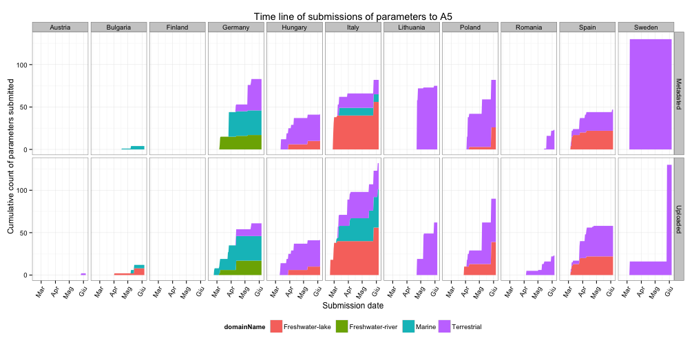

```{r "libraryLoad", cache=FALSE, include=FALSE, echo=FALSE}
library(data.table)
library(RSQLite)
library(sqlutils)
library(plyr)
library(xtable)
suppressPackageStartupMessages(library(googleVis))
options(gvis.plot.tag='chart')

assignInNamespace("cedta.override","slidify","data.table") 
```

```{r "functions", cache=TRUE, include=FALSE, echo=FALSE}
countryPlot <- function(country_df, id) {
  plot(
    gvisMap(
      country_df
      , locationvar = "latLong"
      , tipvar      = "siteName"
      , options     = list(
        mapType     = 'terrain'
        , useMapTypeControl = TRUE
        , width     = 970
        , height    = 200
        )
      , chartid = paste0("CountryAndDomainPlot", sub("-", "", id))
      )
    )
  }
printAggrData <- function(country_df) {
  print(
    xtable(
      head(country_df[with(country_df, order(-Sites)), ], 20))
      , type = 'html'
      , html.table.attributes = ''
      , include.rownames = FALSE
    )
}
aggregatreByParameter <- function(country_df) {
  if (nrow(country_df) > 0) {
    tmp_df <- ddply(
      country_df
      , .(parameterName)
      , summarize
      , Count = length(parameterName)
      )
  } else {
    tmp_df <- data.frame(parameterName = "None", Count = "N/A")
  }
  colnames(tmp_df) <- c("Parameter name", "Sites")
  tmp_df
}
```

```{r "dbSetup", cache=FALSE, include=FALSE, echo=FALSE}
# Setup e connessione SQLite -----------------------------------------------


sqlPaths("~/Documents/Academy/IBAF/ENVEUROPE/A5Finland/sql")

db.sqlite.cfg  <- list(
  fName    = "~/Documents/Academy/IBAF/ENVEUROPE/A5/DB/EEA5SiteParameters.db"
  , driver =  dbDriver("SQLite")
  , query  = list("getAvailableDataByCountry", "getAvailableDataByDomain", "getSiteCountByCountry")
  , queryTitle = list("Uploaded Data by country", "Uploaded data by domain", "# of sites by country")
  , countryNames = c("Austria", "Bulgaria", "Finland", "Germany", "Hungary", "Italy", "Lithuania", "Poland", "Romania", "Spain", "Sweden")
  , domainNames = c("Terrestrial", "Freshwater-lake", "Freshwater-river", "Marine")
)

dbConnection <- with(db.sqlite.cfg, dbConnect(driver, dbname = fName))

```

## Introduction

* A5 represents the experimental phase of the project, based on the sampling in the field of the new and pre‐existing parameters and indicators at different level/scales of investigation, at EnvEurope sites, with specific monitoring intensities and with methods adjusted to the respective intensity of survey.

* During 2012 each site was asked for the list of parameters they would deliver

---
## Submission timeline

* Only nearly 45% of expected parameter datasets has been submitted so far...
* ...and submission window has ended well over 3 months ago!




---
## Relevant issues brought up

* **DEIMS** has undergone quite a few undocumented changes since its first deployment that resulted in some confusion

* **Data tool** although set up to mimick ICP format, it is perceived as a daunting task

* **FTP archive** someone has experienced login problems. It's definetly not the way to go for file sharing

* **Google Drive sheets** perceived as "a waste of time"


---
## What can be done

* Integrated upload and metadata processes

* Let the system keep track of the link between the dataset and its metadata set


---
## Available parameters: Austria (# `r tmpCountry <- 1; execQuery(db.sqlite.cfg$query[[3]], connection = dbConnection, countryName = db.sqlite.cfg$countryNames[tmpCountry])$Count` sites)

```{r "countryRawDataQuery", echo=FALSE, cache=FALSE}
sqlQueryToDataTable <- function(countryName, sqlQuery = db.sqlite.cfg$query[[1]]) {
  data.table(
    execQuery(sqlQuery, connection = dbConnection, countryName = countryName)
    , key = c("siteLTERCode", "siteName", "domainName")
  )
}
# Get Country data
countryRawData_l <- lapply(db.sqlite.cfg$countryNames, sqlQueryToDataTable)
# Convert Lat and Long coordinates in Lat:Long
countryRawData_l <- lapply(
  countryRawData_l
  , function(country_dt) country_dt[, latLong := paste(siteLat, siteLong, sep = ":")]
  )

# Aggregate per parameter name
countryAggrData_l <- countryRawData_l
countryAggrData_l <- lapply(countryAggrData_l, aggregatreByParameter)
```


```{r "Austria", echo=FALSE, cache=FALSE, results='asis', warning=FALSE}
countryPlot(unique(countryRawData_l[[tmpCountry]]), db.sqlite.cfg$countryNames[tmpCountry])
printAggrData(countryAggrData_l[[tmpCountry]])
```


---
## Available parameters: Bulgaria (# `r tmpCountry <- 2; execQuery(db.sqlite.cfg$query[[3]], connection = dbConnection, countryName = db.sqlite.cfg$countryNames[tmpCountry])$Count` sites)

```{r "Bulgaria", echo=FALSE, cache=FALSE, results='asis', warning=FALSE}
tmpCountry <- 2
countryPlot(unique(countryRawData_l[[tmpCountry]]), db.sqlite.cfg$countryNames[tmpCountry])
printAggrData(countryAggrData_l[[tmpCountry]])
```


---
## Available parameters: Finland (# `r tmpCountry <- 3; execQuery(db.sqlite.cfg$query[[3]], connection = dbConnection, countryName = db.sqlite.cfg$countryNames[tmpCountry])$Count` sites)

```{r "Finland", echo=FALSE, cache=FALSE, results='asis', warning=FALSE}
countryPlot(unique(countryRawData_l[[tmpCountry]]), db.sqlite.cfg$countryNames[tmpCountry])
printAggrData(countryAggrData_l[[tmpCountry]])
```


---
## Available parameters: Germany (# `r tmpCountry <- 4; execQuery(db.sqlite.cfg$query[[3]], connection = dbConnection, countryName = db.sqlite.cfg$countryNames[tmpCountry])$Count` sites)

```{r "Germany", echo=FALSE, cache=FALSE, results='asis', warning=FALSE}
countryPlot(unique(countryRawData_l[[tmpCountry]]), db.sqlite.cfg$countryNames[tmpCountry])
printAggrData(countryAggrData_l[[tmpCountry]])
```


---
## Available parameters: Hungary (# `r tmpCountry <- 5; execQuery(db.sqlite.cfg$query[[3]], connection = dbConnection, countryName = db.sqlite.cfg$countryNames[tmpCountry])$Count` sites)

```{r "Hungary", echo=FALSE, cache=FALSE, results='asis', warning=FALSE}
countryPlot(unique(countryRawData_l[[tmpCountry]]), db.sqlite.cfg$countryNames[tmpCountry])
printAggrData(countryAggrData_l[[tmpCountry]])
```


---
## Available parameters: Italy (# `r tmpCountry <- 6; execQuery(db.sqlite.cfg$query[[3]], connection = dbConnection, countryName = db.sqlite.cfg$countryNames[tmpCountry])$Count` sites)

```{r "Italy", echo=FALSE, cache=FALSE, results='asis', warning=FALSE}
countryPlot(unique(countryRawData_l[[tmpCountry]]), db.sqlite.cfg$countryNames[tmpCountry])
printAggrData(countryAggrData_l[[tmpCountry]])
```


---
## Available parameters: Lithuania (# `r tmpCountry <- 7; execQuery(db.sqlite.cfg$query[[3]], connection = dbConnection, countryName = db.sqlite.cfg$countryNames[tmpCountry])$Count` sites)

```{r "Lithuania", echo=FALSE, cache=FALSE, results='asis', warning=FALSE}
countryPlot(unique(countryRawData_l[[tmpCountry]]), db.sqlite.cfg$countryNames[tmpCountry])
printAggrData(countryAggrData_l[[tmpCountry]])
```


---
## Available parameters: Poland (# `r tmpCountry <- 8; execQuery(db.sqlite.cfg$query[[3]], connection = dbConnection, countryName = db.sqlite.cfg$countryNames[tmpCountry])$Count` sites)

```{r "Poland", echo=FALSE, cache=FALSE, results='asis', warning=FALSE}
countryPlot(unique(countryRawData_l[[tmpCountry]]), db.sqlite.cfg$countryNames[tmpCountry])
printAggrData(countryAggrData_l[[tmpCountry]])
```


---
## Available parameters: Romania (# `r tmpCountry <- 9; execQuery(db.sqlite.cfg$query[[3]], connection = dbConnection, countryName = db.sqlite.cfg$countryNames[tmpCountry])$Count` sites)

```{r "Romania", echo=FALSE, cache=FALSE, results='asis', warning=FALSE}
countryPlot(unique(countryRawData_l[[tmpCountry]]), db.sqlite.cfg$countryNames[tmpCountry])
printAggrData(countryAggrData_l[[tmpCountry]])
```


---
## Available parameters: Spain (# `r tmpCountry <- 10; execQuery(db.sqlite.cfg$query[[3]], connection = dbConnection, countryName = db.sqlite.cfg$countryNames[tmpCountry])$Count` sites)

```{r "Spain", echo=FALSE, cache=FALSE, results='asis', warning=FALSE}
countryPlot(unique(countryRawData_l[[tmpCountry]]), db.sqlite.cfg$countryNames[tmpCountry])
printAggrData(countryAggrData_l[[tmpCountry]])
```


---
## Available parameters: Sweden (# `r tmpCountry <- 11; execQuery(db.sqlite.cfg$query[[3]], connection = dbConnection, countryName = db.sqlite.cfg$countryNames[tmpCountry])$Count` sites)

```{r "Sweden", echo=FALSE, cache=FALSE, results='asis', warning=FALSE}
countryPlot(unique(countryRawData_l[[tmpCountry]]), db.sqlite.cfg$countryNames[tmpCountry])
printAggrData(countryAggrData_l[[tmpCountry]])
```


---
## Available parameters per domain: Terrestrial

```{r "domainRawDataQuery", echo=FALSE, cache=FALSE}
sqlDomainQueryToDataTable <- function(domainName, sqlQuery = db.sqlite.cfg$query[[2]]) {
  data.table(
    execQuery(sqlQuery, connection = dbConnection, domainName = domainName)
    , key = c("siteLTERCode", "siteName", "domainName")
  )
}
# Get Domain data
domainRawData_l <- lapply(db.sqlite.cfg$domainNames, sqlDomainQueryToDataTable)
# Convert Lat and Long coordinates in Lat:Long
domainRawData_l <- lapply(
  domainRawData_l
  , function(domain_dt) domain_dt[, latLong := paste(siteLat, siteLong, sep = ":")]
  )
# Aggregate per parameter name
domainAggrData_l <- domainRawData_l
domainAggrData_l <- lapply(domainAggrData_l, aggregatreByParameter)
```

```{r "Terrestrial", echo=FALSE, cache=FALSE, results='asis', warning=FALSE}
tmpDomain <- 1
countryPlot(unique(domainRawData_l[[tmpDomain]]), db.sqlite.cfg$domainNames[tmpDomain])
printAggrData(domainAggrData_l[[tmpDomain]])
```


---
## Available parameters per domain: Lake

```{r "Freshwater-lake", echo=FALSE, cache=FALSE, results='asis', warning=FALSE}
tmpDomain <- 2
countryPlot(unique(domainRawData_l[[tmpDomain]]), db.sqlite.cfg$domainNames[tmpDomain])
printAggrData(domainAggrData_l[[tmpDomain]])
```


---
## Available parameters per domain: River

```{r "Freshwater-river", echo=FALSE, cache=FALSE, results='asis', warning=FALSE}
tmpDomain <- 3
countryPlot(unique(domainRawData_l[[tmpDomain]]), db.sqlite.cfg$domainNames[tmpDomain])
printAggrData(domainAggrData_l[[tmpDomain]])
```


---
## Available parameters per domain: Marine

```{r "Marine", echo=FALSE, cache=FALSE, results='asis', warning=FALSE}
tmpDomain <- 4
countryPlot(unique(domainRawData_l[[tmpDomain]]), db.sqlite.cfg$domainNames[tmpDomain])
printAggrData(domainAggrData_l[[tmpDomain]])
```


---
## Discussion kick off

1. A spatial metanalysis

2. Objective: peer-review paper?

3. Highly common parameters measured accross sites:
  * Mean **temperature** and precipitation, at monthly and year level
  * **Biomass** (Chlorophyll a), Biomass of vascular plants
  
4. **Domain-wise** or **single** expert panel? Domain specific common parameters:
  * **Terrestrial**: Soil C/N, biodiversity (species list, coverage), atmospheric depositions
  * **Freshwater lake**: physical/chemical characteristics
  * **Marine**: physical/chemical characteristics

5. If you still did not hand in data for year 2012, please do, now!


```{r "closeDBConnection", cache=FALSE, include=FALSE, echo=FALSE}
dbDisconnect(dbConnection)
```